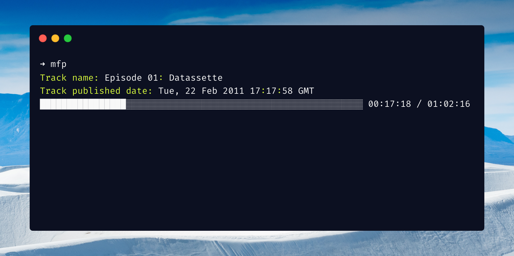

# mfp: music for programming

[](https://crates.io/crates/mfp)
[](https://github.com/guptarohit/mfp/releases)

A command-line utility for playing music mixes for programming & focus (from [musicforprogramming.net](https://musicforprogramming.net)), unlocking the flow state!




## Installation

Using [Cargo](https://rustup.rs/) 📦:
  
```bash
cargo install mfp
```

Or download pre-built binary from [GitHub release page](https://github.com/guptarohit/mfp/releases).

After installation, run `mfp` in command line to start. Plays a random track if not specified with `-t` flag.


## Usage

```bash  
mfp [OPTIONS]

Options:
  -t, --track-number <TRACK_NUMBER>  Track Number, between 1 and ~68
  -v, --volume <VOLUME>              Volume, between 0 and 9 [default: 9]
  -h, --help                         Print help
  -V, --version                      Print version
```

e.g. `mfp -t 1 -v 7`


## Acknowledgements

Inspired from: https://github.com/JasonWei512/code-radio-cli

and https://github.com/isdampe/music-for-programming

Mixes streams from [musicforprogramming.net](https://musicforprogramming.net)

## Contributing

Feel free to make a pull request! :octocat:
